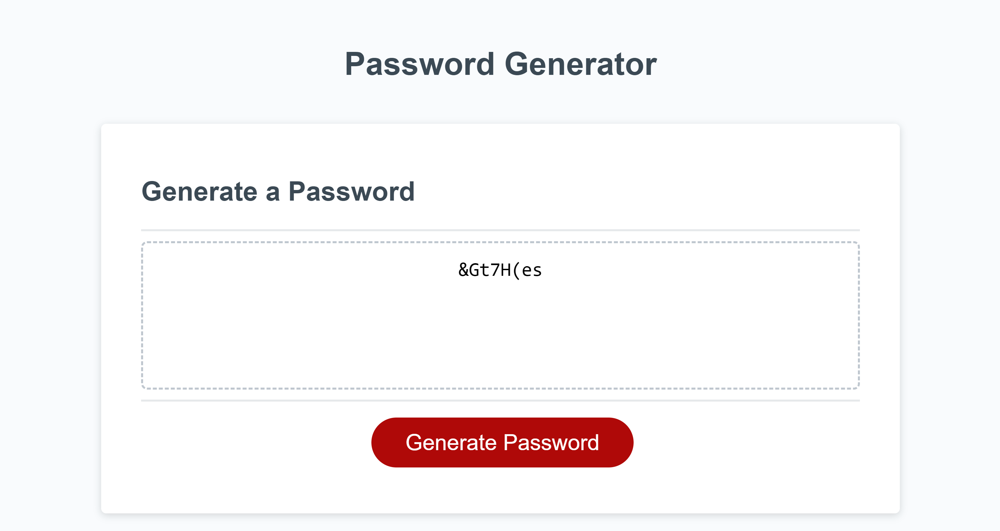

# <Random-Password-Generator>

## Description

This is a project to utilize JavaScript to implement logic to the webpage for a certain set of criteria to be met by the user to generate a randomized password.

## Installation

N/A

## Usage

To start, click on the generate password button to see a browser window pop-up. This prompt will accept numerical digits between 8 and 128. If the user enters anything outside of these parameters, then a window will pop-up indicating that the user should try again. After the initial question, the user should then click "OK" to include the following options: numbers, lowercase letters, uppercase letters and special characters. Upon clicking the final window pop-up, a newly random password will be displayed on the screen based off of the user's inputs. 

A screenshot of the [Password-Generator](https://christoph551.github.io/Password-Generator/) 

## Credits

Original Source Code pulled from [Xandromus](https://github.com/coding-boot-camp/friendly-parakeet)
Also referenced [MDN Web Docs](https://developer.mozilla.org/en-US/docs/Web/JavaScript/Reference/Global_Objects/parseInt), [MDN Web Docs](https://developer.mozilla.org/en-US/docs/Web/JavaScript/Reference/Global_Objects/isNaN), [Stack Overflow](https://stackoverflow.com/questions/3010840/loop-through-an-array-in-javascript/3010848#3010848) and [MDN Web Docs](https://developer.mozilla.org/en-US/docs/Web/JavaScript/Reference/Global_Objects/Function).

## License

Please refer to the License in the repo.
